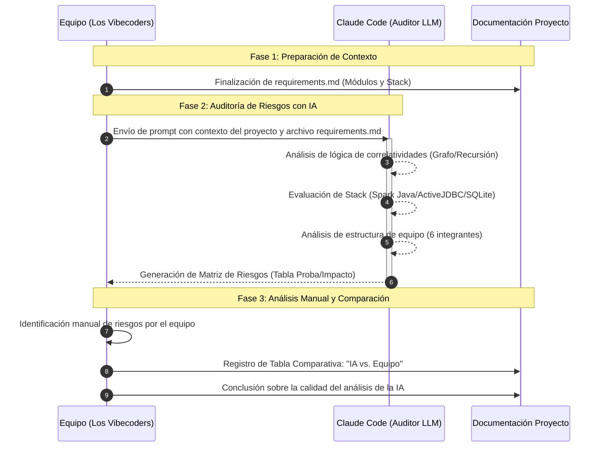

# Auditoría de Riesgos con IA - Los Vibecoders

Este documento registra el cumplimiento de la **Actividad 2** del Proyecto Integrador, utilizando un modelo de lenguaje de gran escala (LLM) como auditor externo para identificar vulnerabilidades en el sistema.

---

## 1. Trazabilidad del Proceso

Para asegurar la validez de la auditoría, se presenta el flujo de trabajo seguido por el equipo:

---

## 2. Prompt Utilizado
**Instrucción enviada a Claude Code:**

>
> Actúa como un auditor senior de proyectos de software que cuenta con mas de 20 años de experiencia.
> Analizá el siguiente contexto de mi proyecto 'Sistema de Gestión Estudiantil' para la Universidad
>
> [ARCHIVO REQUIREMENTS.MD] y la siguiente estructura
>
> [Comando "tree /f"]
>
> Realizá una autopsia preventiva. No quiero obviedades.
> Entregá los resultados estrictamente en esta tabla:
>
> | Tipo de Riesgo | Descripción | Probabilidad | Impacto | Identificado por |
> |---|---|---|---|---|
> | Técnico | | | | |
> | Organizacional | | | | |
> | Planificación | | | | |
> | Humano | | | | |
>
> Para la columna Descripción, no uses frases genéricas. Quiero que vincules el riesgo con mi estructura de archivos. Arrancá a leer primero el archivo Requirements.md

---

## 3. Matriz de Riesgos Detectados por la IA

| Tipo de Riesgo | Descripción | Probabilidad | Impacto | Identificado por |
|----------------|-------------|--------------|---------|------------------|
| Técnico | El uso de ActiveJDBC con SQLite crea dependencia de un ORM poco común que puede generar problemas de mantenimiento y dificultad para encontrar desarrolladores familiarizados con la tecnología, especialmente considerando que el proyecto requiere correlatividades complejas que podrían necesitar consultas SQL avanzadas (identificado en pom.xml lines 68-73 y estructura de modelos en src/main/java/com/is1/proyecto/models/) | Alta | Alta | Identificado por Claude Code durante análisis de dependencias y estructura |
| Técnico | La lógica de paginación en /professor/list está implementada en Java en lugar de usar capacidades nativas de SQL, lo que podría causar problemas de performance con grandes volúmenes de datos dado que se cargan todos los profesores en memoria antes de aplicar limit/offset (identificado en App.java líneas 419-424 donde se ejecuta Professor.findAll().limit().offset().toMaps()) | Media | Alta | Identificado por Claude Code durante análisis de App.java |
| Organizacional | El equipo de 6 miembros tiene responsabilidades distribuidas por módulo funcional según GitHub Projects, pero no hay evidencia de un arquitecto técnico definido que asegure la consistencia entre módulos, especialmente crítico para el flujo de inscripciones que depende de múltiples módulos (usuarios, académico, inscripciones) (identificado en requirements.md sección 6.3 sobre distribución de responsabilidades y 6.8 sobre uso de GitHub Projects) | Media | Alta | Identificado por Claude Code durante análisis de requirements.md |
| Planificación | El proyecto depende de un archivo dev.db estandarizado para evitar inconsistencias entre miembros (mencionado en problemas encontrados), pero no se especifica un mecanismo automatizado para sincronizar esquemas o datos de prueba, lo que podría causar fallos silenciosos en desarrollo (identificado en requirements.md sección 6.2 problema #3 sobre estandarización del entorno de desarrollo) | Media | Media | Identificado por Claude Code durante análisis de requirements.md |
| Humano | La complejidad en el modelado UML de la recursividad para correlatividades de materias (problema identificado #1) sugiere que el equipo podría subestimar la dificultad algorítmica de validar cadenas de prerrequisitos, especialmente cuando se consideran condiciones de "Regular" vs "Aprobada" (identificado en requirements.md sección 6.2 problema #1 sobre complejidad en modelado UML de correlatividades) | Alta | Alta | Identificado por Claude Code durante análisis de requirements.md |
| Técnico | La autenticación basada en sesiones de Spark Java no incluye protección contra CSRF ni uso de HTTPS en desarrollo, lo que representa una vulnerabilidad de seguridad crítica dado que el sistema maneja credenciales y datos académicos sensibles (identificado en App.java falta de filtros de seguridad como CSRF tokens o configuración de SSL) | Alta | Alta | Identificado por Claude Code durante análisis de App.java |
| Organizacional | El uso de Mustache para plantillas requiere que la lógica de presentación se mantenga en Java (como se ve en la paginación), lo que viola la separación de preocupaciones y aumenta la carga cognitiva para desarrolladores que deben trabajar simultáneamente en lógica de negocio y presentación (identificado en App.java líneas 430-452 donde se construyen objetos de paginación en Java para consumo en Mustache) | Media | Media | Identificado por Claude Code durante análisis de App.java |
| Planificación | No hay evidencia de estrategias de pruebas integradas más allá de un test unitario triviale (AppTest.java), lo que es riesgoso dada la complejidad del motor de reglas requerido para validaciones de correlatividades y cupos (identificado en src/test/java/com/is1/proyecto/AppTest.java que solo contiene un test que siempre pasa y requirements.md sección 3 que describe funcionalidades complejas sin evidencia de plan de testing) | Alta | Alta | Identificado por Claude Code durante análisis de estructura de test y requirements.md |

---

## 4. Matriz de Riesgos Detectados por el Equipo

| Tipo de Riesgo | Descripción | Probabilidad | Impacto | Identificado por |
|----------------|-------------|--------------|---------|------------------|
| Técnico | **Inconsistencia de Entornos:** Debido al uso de distintos sistemas operativos (Windows/Linux) entre los integrantes, existe el riesgo de errores en rutas de archivos y ejecución de dependencias al integrar módulos. | Alta | Media | Equipo |
| Organizacional | **Fragmentación de la comunicación:** La falta de coincidencia en horarios laborales y académicos genera un flujo de información asincrónico, dificultando la toma de decisiones rápidas y la consistencia entre módulos. | Alta | Media | Equipo |
| Planificación | **Superposición de calendario académico:** Las fechas críticas de desarrollo coinciden con exámenes parciales de otras materias, poniendo en riesgo el cumplimiento de hitos finales del proyecto integrador. | Alta | Crítico | Equipo |
| Humano | **Brecha de conocimientos específicos:** El equipo presenta niveles desiguales de experiencia con las herramientas solicitadas y la lógica algorítmica de correlatividades, requiriendo tiempo extra de capacitación. | Media | Baja | Equipo |

---

## 5. Comparación de Análisis: IA vs. Equipo

### Riesgos que encontró la IA y el equipo no:
La IA realizó un análisis técnico exhaustivo que detectó vulnerabilidades críticas en el código, como la carga de datos ineficiente en memoria en [App.java](App.java) y la ausencia de protecciones de seguridad como tokens CSRF o HTTPS. También identificó dependencias tecnológicas poco comunes en el [pom.xml](pom.xml) que podrían dificultar el mantenimiento futuro.

### Riesgos que encontró el equipo y la IA no:
El equipo identificó problemas logísticos y contextuales que la IA ignora por completo. Esto incluye la falta de tiempo real por obligaciones laborales y académicas, la dificultad de coordinar a 6 personas con horarios distintos y los problemas técnicos de compatibilidad entre Windows y Linux que surgen en el día a día.

### Calidad del análisis:

* **Análisis de la IA:** Es de nivel "exquisito" en cuanto a la lógica de programación, logrando vincular problemas directamente con líneas específicas de archivos como [App.java](App.java) y [requirements.md](requirements.md).
  * **Análisis del Equipo:** Es un análisis de gestión de recursos humanos y viabilidad. Como novatos, el equipo aporta la visión de las barreras de aprendizaje y la ejecución real del proyecto que el código no refleja.

---

## 6. Conclusión sobre la Calidad del Análisis

La IA funciona como un **auditor técnico senior** que previene fallos de rendimiento y seguridad, mientras que el equipo actúa como el **gestor de proyectos** que entiende las limitaciones físicas y de tiempo. Ambos análisis son complementarios: la IA asegura que el sistema sea sólido y el equipo asegura que el proyecto realmente se pueda terminar.